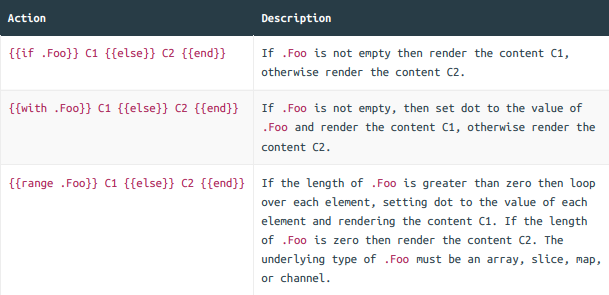
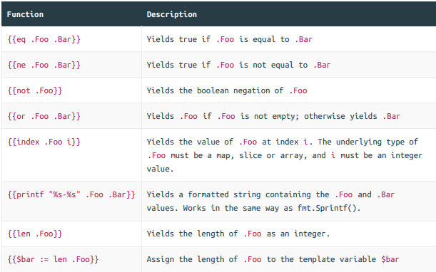

# **ui\html\pages** section info 

### Displaying dynamic data

### Dynamic content escaping
The html/template package automatically escapes any data that is yielded between {{ }}
tags. This behavior is hugely helpful in avoiding cross-site scripting (XSS) attacks, and is the
reason that you should use the html/template package instead of the more generic
text/template package that Go also provides.
As an example of escaping, if the dynamic data you wanted to yield was

 ```
<span>{{"<script>alert('xss attack')</script>"}}</span>
 ```
It would be rendered harmlessly as:

```
<span>&lt;script&gt;alert(&#39;xss attack&#39;)&lt;/script&gt;</span>
```

The html/template package is also smart enough to make escaping context-dependent. It
will use the appropriate escape sequences depending on whether the data is rendered in a
part of the page that contains HTML, CSS, Javascript or a URI.


### Template actions and functions

In this section we’re going to look at the template actions and functions that Go provides.
We’ve already talked about some of the actions — {{define}}, {{template}} and
{{block}} — but there are three more which you can use to control the display of dynamic
data — {{if}}, {{with}} and {{range}}.




There are a few things about these actions to point out:
- For all three actions the {{else}} clause is optional. For instance, you can write {{if .Foo}} C1 {{end}} if there’s no C2 content that you want to render.
- The empty values are false, 0, any nil pointer or interface value, and any array, slice, map, or string of length zero.
- It’s important to grasp that the with and range actions change the value of dot. Once you start using them, what dot represents can be different depending on where you are in the template and what you’re doing.

The html/template package also provides some template functions which you can use to
add extra logic to your templates and control what is rendered at runtime. You can find a
complete listing of functions [here](https://pkg.go.dev/text/template#hdr-Functions), but the most important ones are:



  ``` ```